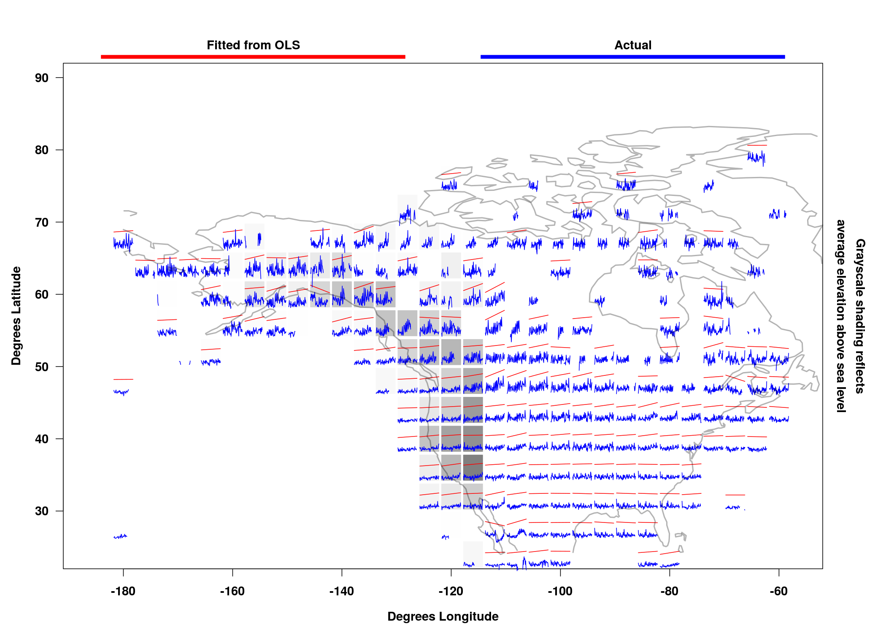
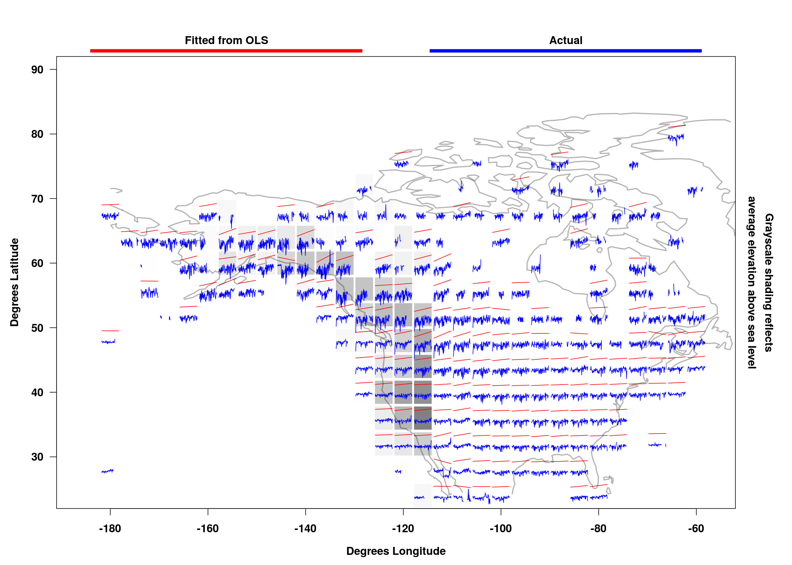
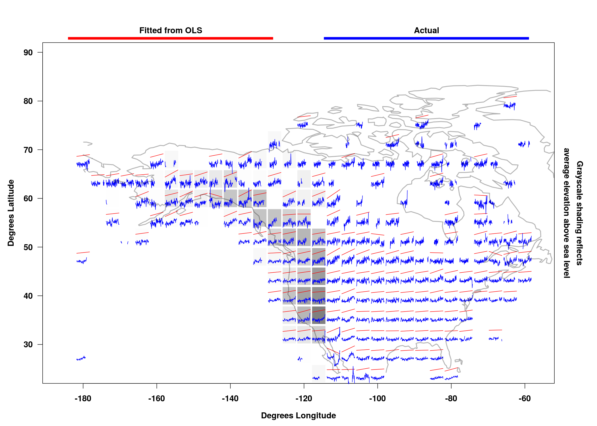
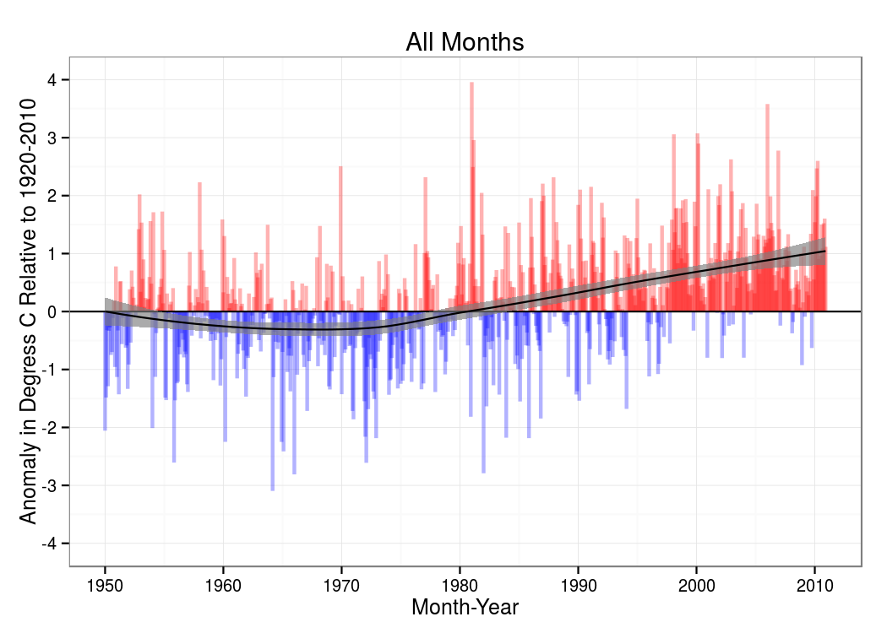
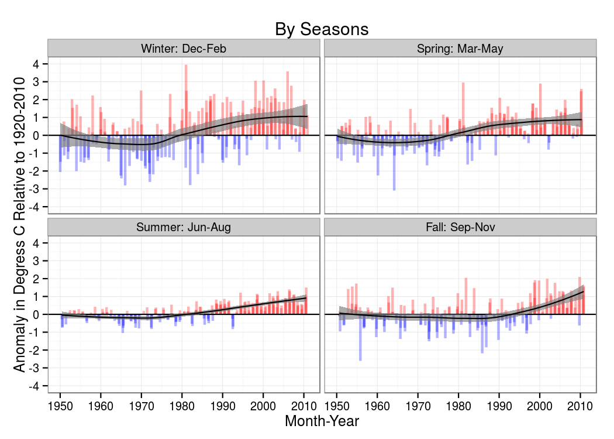
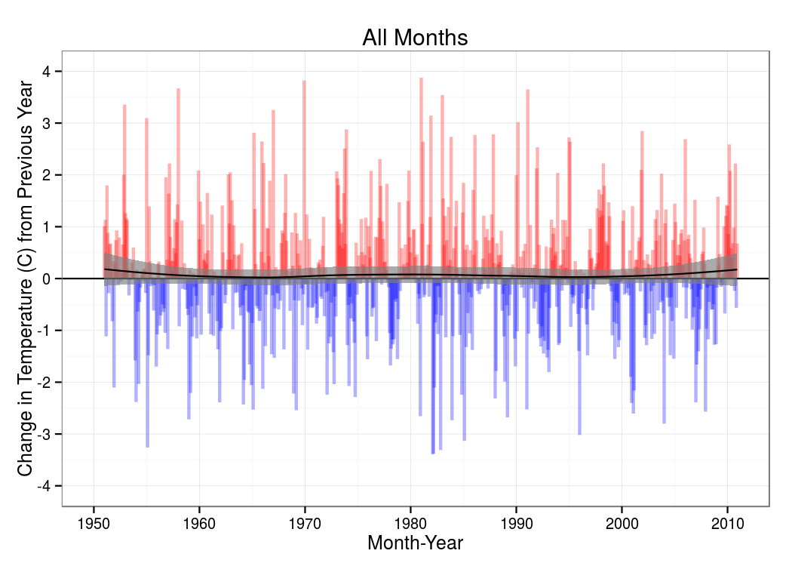
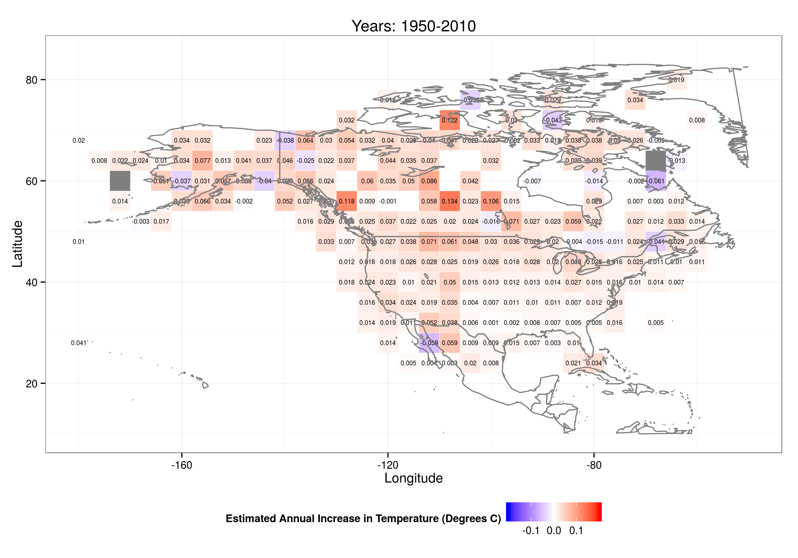

# Climate Change in North America

## Summary
Using average monthly surface temperature data from the National Oceanic and Atmospheric Administration (NOAA), I analyzed the rate of climate change in the U.S. and Canada for two periods: 1950-1980 and 1980-2010. Using data visualization and regression analysis, I determined that the annual rate of global warming is significantly greater in the second period (p-value < 0.001) than the first. Furthermore, Western parts of the U.S. and Canada, including Alaska, experienced higher rates of warming compared with other regions. 

## Data Source
The data for my analysis comes from the Global Historical Climatology Network Monthly (GHCNM) dataset Version 3. It contains the mean monthly temperature for 7280 weather stations around the world. I used the "adjusted" version of the dataset because the researchers who created the GHCNM dataset have implemented quality control. Because the large size of the dataset, I discretized the dataset into grids of 4 degrees in length and width; I use the mean monthly temperature of stations within each grid as my unit of analysis. Each grid receives equal weight in my analysis.

## Sparkline Visualization

To visualize the data in its most raw form, I constructed sparkline maps that show the monthly anomaly from 1950 to 2010. According to [NOAA's monitoring references] (https://www.ncdc.noaa.gov/monitoring-references/faq/anomalies.php):

> The term temperature anomaly means a departure from a reference value or long-term average. A positive anomaly indicates that the observed temperature was warmer than the reference value, while a negative anomaly indicates that the observed temperature was cooler than the reference value.

For each grid and month, the reference temperature is the mean temperature for that grid and month in 1920-2010. For each grid, month, and year, I created the anomaly variable by subtracting the reference temperature from that grid's monthly temperature that year. 

For each grid, I made sparkline maps that show the following:

* maximum anomaly temperature for each year
* minimum anomaly temperature for each year
* mean anomaly temperature for each year

For grids that have less than 25 percent monthly data missing, I also display the best linear predictor for each trend mentioned above. Overall, I found that maximum, minimum, and mean anomaly temperatures have been increasing over time. Nevertheless, there exist variations in the warming rate. Rates of warming are greater in Western U.S. and Canada compared with the rest of the U.S. 

### Maximum Anomaly Temperatures: 1950-2010

### Minimum Anomaly Temperatures: 1950-2010
 

### Mean Anomaly Temperatures: 1950-2010

## Rates of Global Warming

### Changes in Trend Across Time

Next, I estimated the rate of warming across the entire region of interest and for each grid. First, I consider the monthly anomaly as a time series for the entire region. I constructed the following plot:

Besides plotting the actual data in each plot, I included the fitted trend line from a loess regression along with its 95 percent confidence interval. In the first period, there did not seem to be much evidence of warming. For most years between 1950 and 1979, the average monthly temperature was below that of reference temperature. In the first period, I estimated the annual rate of temperature change to be -0.007 degrees C. In the second period, however, the average monthly temperature was above the reference temperature for most months. Furthermore, after 1980, annual warming appears to follow a linear trend, increasing at a rate of 0.032 degrees C annually.

Furthermore, I constructed the time series dividing the data into the four seasons. The change in warming trends between the two periods is most visible in the winter and spring months. The change in trend occurred around 1990 for the fall months. 

To estimate the difference in annual trend between the two periods, I used OLS regression with two model specifications. For both models, I used monthly anomaly as my outcome variable. Predictor variables included year, a dummy variable for period, and an interaction between year and the dummy variable for period. In Model 1, I included fixed effects for month. In Model 2, I included fixed effects for month and grid. The results from my regressions are reported in the following table:
 
|                       | Model 1 | Model 2     |
|-----------------------|---------|-------------|
| Period 1: 1950-1979 annual rate | -0.007  | -0.008      |
| Period 2: 1980-2010 annual rate | 0.032   | 0.034       |
| Difference in rates (SE)  | 0.040 (0.002)   | 0.041 (0.002)      |
| Fixed effects         | month   | month, grid |

As one can see, the difference in annual rates is statistically significant (p-value < 0.001) between the two periods. In the first period, the annual rate of temperature change is somewhat negative; in the second period, the annual rate has become very positive.

In addition, I constructed a time series plot of the changes in the rate of global warming. For each month in the time series, I plotted the change in temperature between the month in the current year and the month of the previous year (i.e., the first difference). I also included a loess regression line along with its 95 percent confidence interval. As the plot shows, the rate of temperature change is fairly constant across time. For almost the whole period, the change in the rate is not statistically indistinguishable from zero.

### Differences in Geography

Furthermore, I estimated the annual rate of change in temperature (1950-1980) for each grid as labeled heatmaps. To prevent extrapolation, I estimated the annual rate of change for only grids that contain more than 100 observations; I included fixed effects for month.

The fastest rates of annual increase in temperature occurred in the Western parts of the U.S. and Canada, including Alaska. The faster rates of warming in the northern parts of the continent is suggestive of polar amplification, the phenomenon in which global warming is more extreme near the poles than in the areas in between. 

